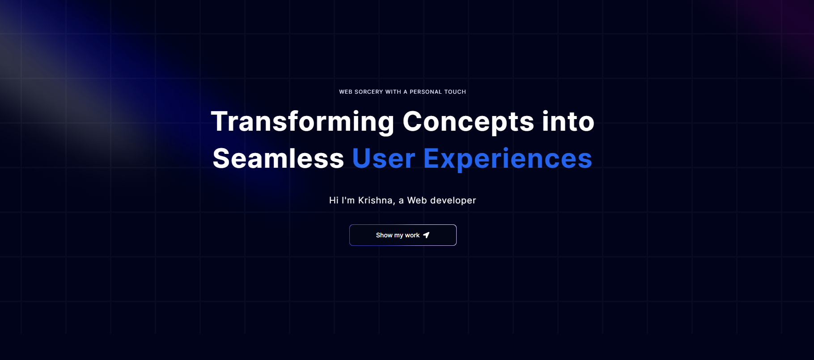

# 🌟 My Personal Portfolio

Welcome to my personal portfolio! This project is a showcase of my work, skills, and projects. It's built using **Next.js** and **TypeScript**, featuring a sleek and responsive design with **Tailwind CSS**.

## 🚀 Technologies Used

- **Next.js**: A powerful React framework for building fast and scalable web applications.
- **TypeScript**: Enhanced JavaScript with type definitions, making the code more robust and maintainable.
- **Tailwind CSS**: A utility-first CSS framework for rapid UI development.

## 🎨 Features

- **Responsive Design**: Ensures that the portfolio looks great on all devices, from desktops to mobile phones.
- **Dynamic Components**: Integrates various dynamic components to enhance user interaction and experience.
- **Modular Code Structure**: Clean and modular codebase, making it easy to maintain and expand.

## 📚 What I Learned

During the development of this portfolio, I:
- Brushed up on my existing tech stack, particularly with **Tailwind CSS**.
- Delved into the basics of **TypeScript** and **Next.js**, building a solid foundation in both technologies.
- Gained experience in integrating components seamlessly from **Acternity UI** to enhance the functionality and design of the site.

## 🌐 Live Demo

Check out the live version of my portfolio [here](https://personal-portfolio-qqblxd8nc-krishnasaichariths-projects.vercel.app/).

## 📸 Screenshots

Thank you for visiting my portfolio! ✨
